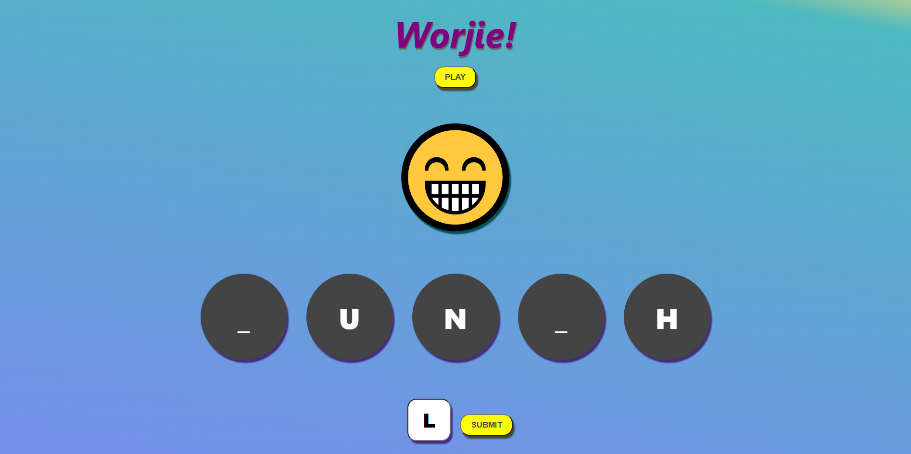

# Worjie

## A fun little word-guessing game

This was created on the afternoon of 04-02-22 for the [School Of Code](www.schoolofcode.com) bootcamp as part of a friday afternoon end of the week hackathon.

Our task was to explore some of the technologies we'd been working with over the past few weeks. Because of the short time alloted to the task we decided to keep things simple and focused on building a fun little game with React.

This is what we got to by the end of the afternoon, it's a pretty simple variation on the game of 'hangman' where the player can guess one letter at a time to slowly reveal the hidden word. Any wrong guesses lead to the loss of a life, and lose 5 lives and it's game over!

